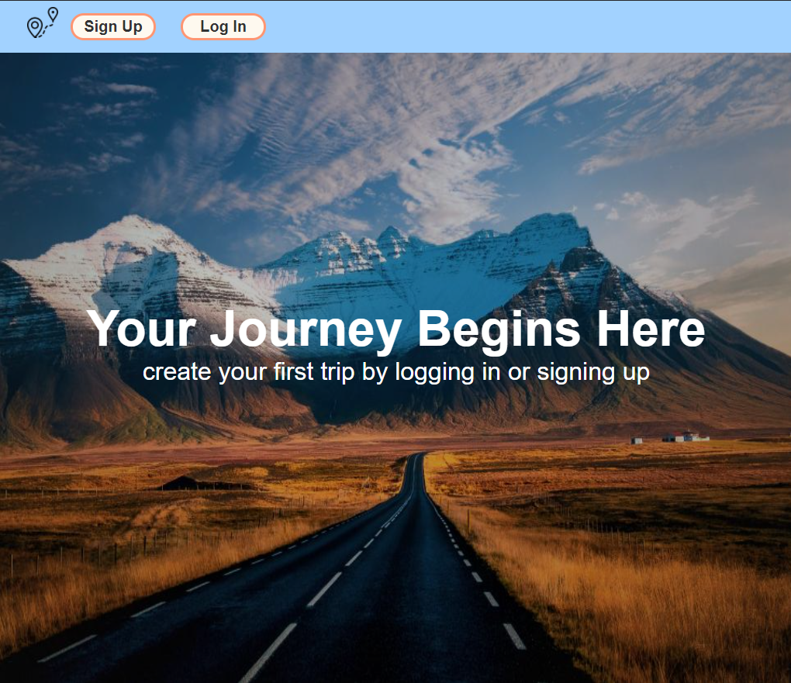
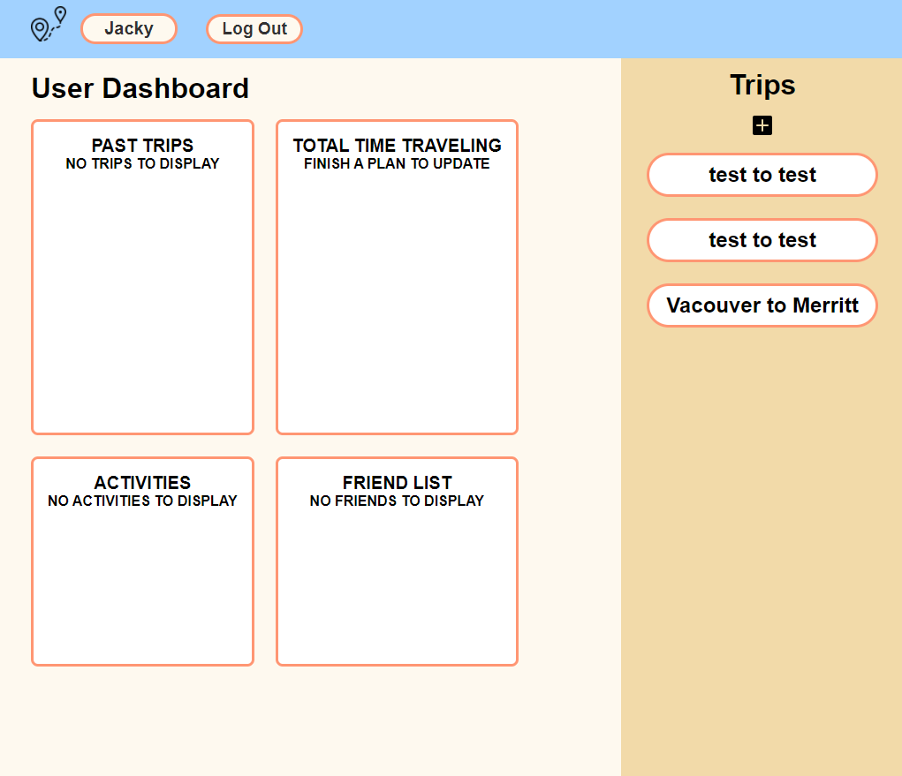
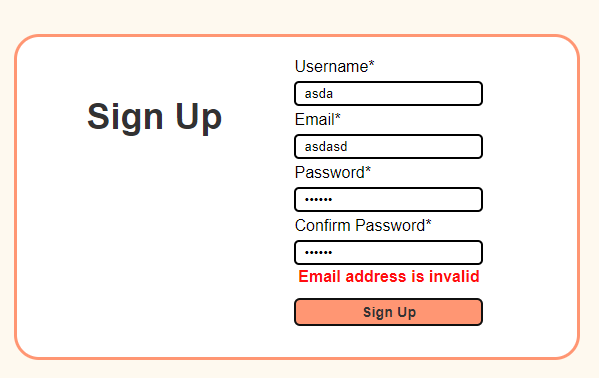
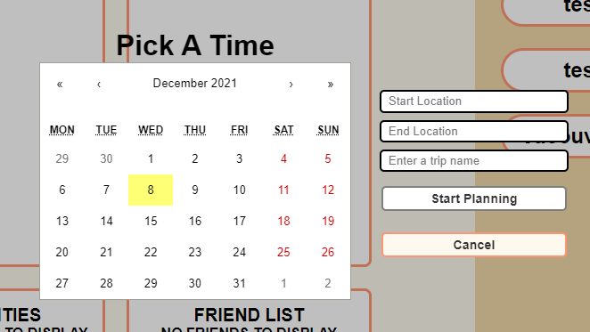
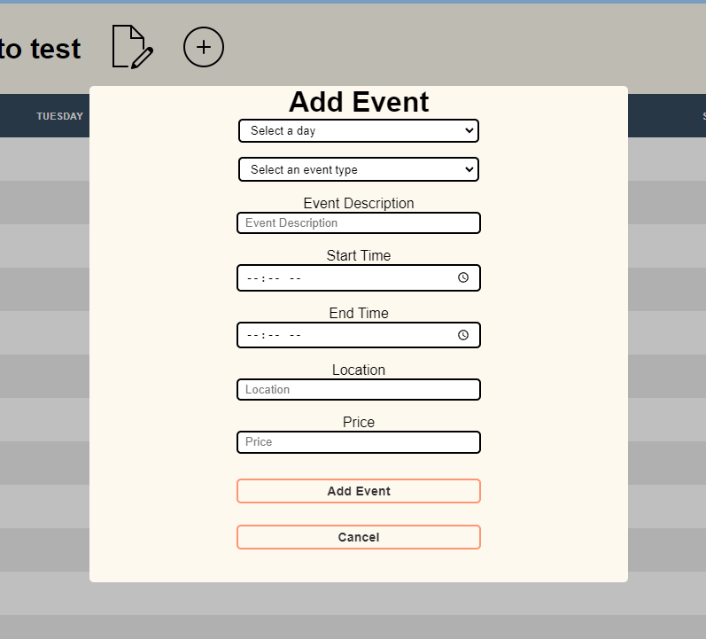
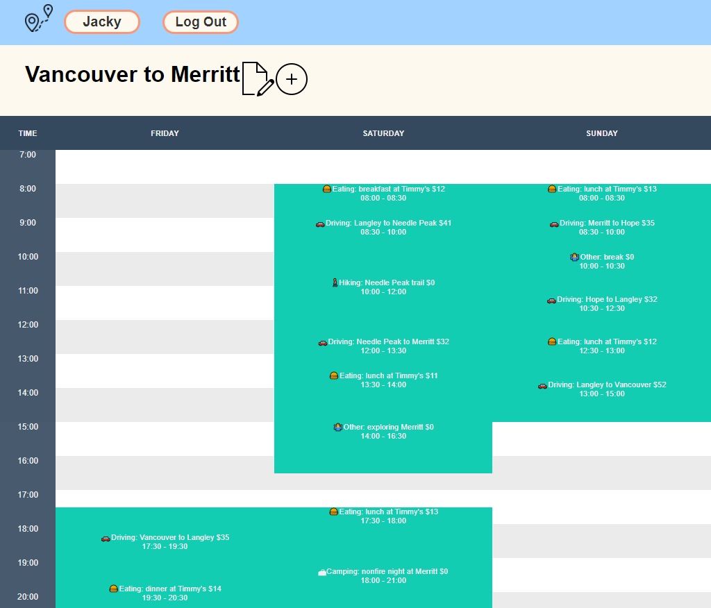

Tech Stack Used:
    MongoDB: document-oriented and no-sql database
    ExpressJS: a Node.js web framework, makesing it easier to manage web applications in the backend
    React: a client-side JavaScript framework, uses components and virtual DOM
    NodeJS: a server-side JavaScript framework

Key Features:
    User-auth: User can sign-up and log-in; Each user can only access the data authorized for that user
    React calendar: User can create a new trip by using a calendar to select the time frame of their trip
    Planner: User can add events to a time table, choosing the time frame, event type, description, and budget

Installation:
    install npm in client by: npm i
    install node in server by: npm init -y

API references:
    This site doesn't use any API. All of the data is user generated. NPM packages such as React-Calendar and React-Timetable-Events which made most of this web app functional

Screenshots:

landing page:

dashboard:

sign-up page: example with error:

add trip modal:

add events modal:

populated trip example:

Lessons learned & next steps:
    1. During the planning stage, test out all the technology and make sure they'll work together well.
    2. Sometimes, it's better to create my own react components than using NPM packages.

    3. The immediate next step is to debug further and make the code more DRY.
    4. Add a mapping api feature and a social feature.
    5. Deploy a stable version to Heroku.
